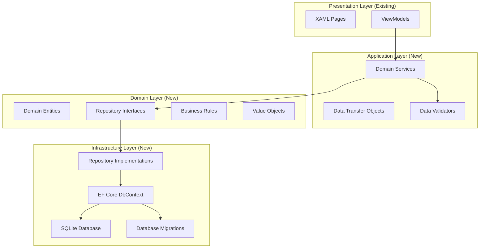
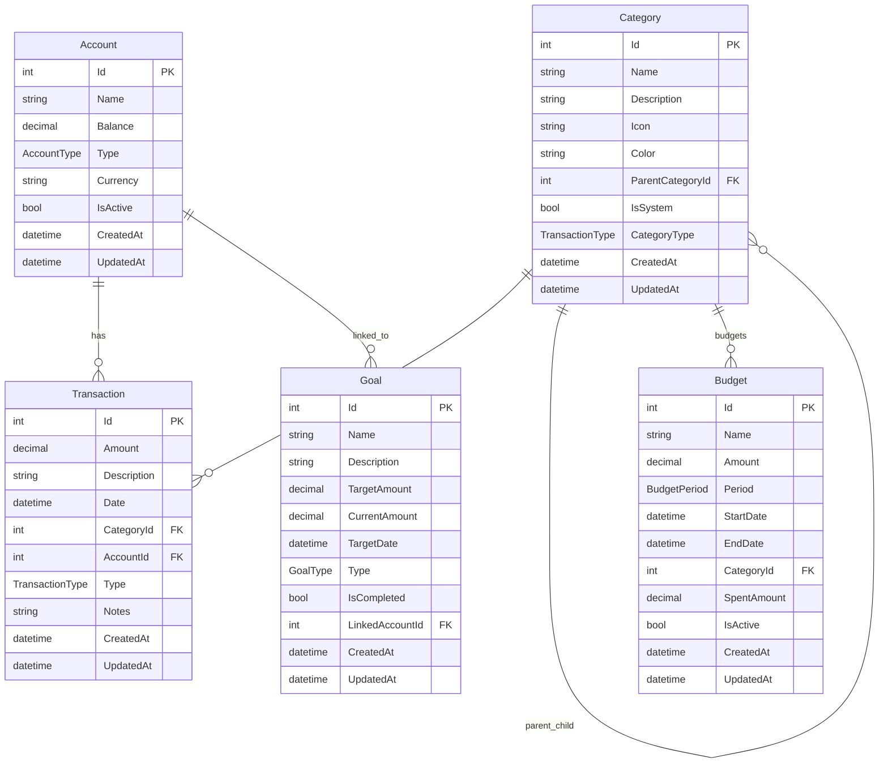

# Design Document

## Overview

This design document outlines the implementation of real data functionality for the FinTrack MAUI application. The design focuses on replacing mock data services with a robust, offline-first data layer using SQLite, Entity Framework Core, and the repository pattern. The implementation will maintain the existing XAML UI while providing real data persistence, validation, and business logic.

## Architecture

### Data Layer Architecture



### Project Structure Updates

```
src/frontend/
├── FinTrack.Core/                    # Domain Layer (Enhanced)
│   ├── Entities/                     # Domain Entities
│   │   ├── BaseEntity.cs
│   │   ├── Transaction.cs
│   │   ├── Account.cs
│   │   ├── Category.cs
│   │   ├── Budget.cs
│   │   └── Goal.cs
│   ├── Enums/                        # Domain Enumerations
│   │   ├── TransactionType.cs
│   │   ├── AccountType.cs
│   │   ├── BudgetPeriod.cs
│   │   └── GoalType.cs
│   ├── Interfaces/                   # Repository Contracts
│   │   ├── IRepository.cs
│   │   ├── ITransactionRepository.cs
│   │   ├── IAccountRepository.cs
│   │   ├── ICategoryRepository.cs
│   │   ├── IBudgetRepository.cs
│   │   └── IGoalRepository.cs
│   ├── ValueObjects/                 # Domain Value Objects
│   │   ├── Money.cs
│   │   └── DateRange.cs
│   └── Exceptions/                   # Domain Exceptions
│       ├── DomainException.cs
│       ├── ValidationException.cs
│       └── BusinessRuleException.cs
├── FinTrack.Infrastructure/          # Infrastructure Layer (New)
│   ├── Data/                         # Database Context
│   │   ├── FinTrackDbContext.cs
│   │   ├── Configurations/           # Entity Configurations
│   │   └── Migrations/               # EF Core Migrations
│   ├── Repositories/                 # Repository Implementations
│   │   ├── BaseRepository.cs
│   │   ├── TransactionRepository.cs
│   │   ├── AccountRepository.cs
│   │   ├── CategoryRepository.cs
│   │   ├── BudgetRepository.cs
│   │   └── GoalRepository.cs
│   └── Services/                     # Infrastructure Services
│       ├── DatabaseService.cs
│       └── MigrationService.cs
├── FinTrack.Shared/                  # Application Layer (Enhanced)
│   ├── Services/                     # Domain Services
│   │   ├── TransactionService.cs
│   │   ├── AccountService.cs
│   │   ├── BudgetService.cs
│   │   └── GoalService.cs
│   ├── DTOs/                         # Data Transfer Objects
│   │   ├── TransactionDto.cs
│   │   ├── AccountDto.cs
│   │   └── BudgetDto.cs
│   ├── Validators/                   # Data Validation
│   │   ├── TransactionValidator.cs
│   │   ├── AccountValidator.cs
│   │   └── BudgetValidator.cs
│   └── Mappers/                      # Entity-DTO Mapping
│       ├── TransactionMapper.cs
│       └── AccountMapper.cs
└── FinTrack.Maui/                    # Presentation Layer (Updated)
    ├── Views/                        # XAML Pages (Existing)
    ├── ViewModels/                   # ViewModels (Updated)
    └── Services/                     # UI Services (Updated)
```

## Components and Interfaces

### Domain Entities

#### BaseEntity
```csharp
public abstract class BaseEntity
{
    public int Id { get; set; }
    public DateTime CreatedAt { get; set; }
    public DateTime UpdatedAt { get; set; }
    public bool IsDeleted { get; set; }
    public string SyncId { get; set; } = Guid.NewGuid().ToString();
    public SyncStatus SyncStatus { get; set; } = SyncStatus.Synced;
    public DateTime? LastSyncAt { get; set; }
}
```

#### Transaction Entity
```csharp
public class Transaction : BaseEntity
{
    [Required]
    [Range(0.01, double.MaxValue, ErrorMessage = "Amount must be greater than 0")]
    public decimal Amount { get; set; }
    
    [Required]
    [StringLength(500, ErrorMessage = "Description cannot exceed 500 characters")]
    public string Description { get; set; } = string.Empty;
    
    [Required]
    public DateTime Date { get; set; }
    
    [Required]
    public int CategoryId { get; set; }
    
    [Required]
    public int AccountId { get; set; }
    
    [Required]
    public TransactionType Type { get; set; }
    
    public string? Notes { get; set; }
    public string? Tags { get; set; }
    
    // Navigation Properties
    public virtual Category Category { get; set; } = null!;
    public virtual Account Account { get; set; } = null!;
}
```

#### Account Entity
```csharp
public class Account : BaseEntity
{
    [Required]
    [StringLength(100, ErrorMessage = "Account name cannot exceed 100 characters")]
    public string Name { get; set; } = string.Empty;
    
    [Required]
    public decimal Balance { get; set; }
    
    [Required]
    public AccountType Type { get; set; }
    
    [Required]
    [StringLength(3, ErrorMessage = "Currency code must be 3 characters")]
    public string Currency { get; set; } = "USD";
    
    public string? Description { get; set; }
    public bool IsActive { get; set; } = true;
    public string? BankName { get; set; }
    public string? AccountNumber { get; set; }
    
    // Navigation Properties
    public virtual ICollection<Transaction> Transactions { get; set; } = new List<Transaction>();
}
```

#### Category Entity
```csharp
public class Category : BaseEntity
{
    [Required]
    [StringLength(100, ErrorMessage = "Category name cannot exceed 100 characters")]
    public string Name { get; set; } = string.Empty;
    
    public string? Description { get; set; }
    public string? Icon { get; set; }
    public string? Color { get; set; }
    public int? ParentCategoryId { get; set; }
    public bool IsSystem { get; set; } = false;
    public TransactionType CategoryType { get; set; }
    
    // Navigation Properties
    public virtual Category? ParentCategory { get; set; }
    public virtual ICollection<Category> SubCategories { get; set; } = new List<Category>();
    public virtual ICollection<Transaction> Transactions { get; set; } = new List<Transaction>();
    public virtual ICollection<Budget> Budgets { get; set; } = new List<Budget>();
}
```

#### Budget Entity
```csharp
public class Budget : BaseEntity
{
    [Required]
    [StringLength(100, ErrorMessage = "Budget name cannot exceed 100 characters")]
    public string Name { get; set; } = string.Empty;
    
    [Required]
    [Range(0.01, double.MaxValue, ErrorMessage = "Amount must be greater than 0")]
    public decimal Amount { get; set; }
    
    [Required]
    public BudgetPeriod Period { get; set; }
    
    [Required]
    public DateTime StartDate { get; set; }
    
    [Required]
    public DateTime EndDate { get; set; }
    
    public int? CategoryId { get; set; }
    public decimal SpentAmount { get; set; } = 0;
    public bool IsActive { get; set; } = true;
    public decimal? AlertThreshold { get; set; }
    
    // Navigation Properties
    public virtual Category? Category { get; set; }
}
```

#### Goal Entity
```csharp
public class Goal : BaseEntity
{
    [Required]
    [StringLength(100, ErrorMessage = "Goal name cannot exceed 100 characters")]
    public string Name { get; set; } = string.Empty;
    
    public string? Description { get; set; }
    
    [Required]
    [Range(0.01, double.MaxValue, ErrorMessage = "Target amount must be greater than 0")]
    public decimal TargetAmount { get; set; }
    
    public decimal CurrentAmount { get; set; } = 0;
    
    [Required]
    public DateTime TargetDate { get; set; }
    
    [Required]
    public GoalType Type { get; set; }
    
    public bool IsCompleted { get; set; } = false;
    public DateTime? CompletedDate { get; set; }
    public int? LinkedAccountId { get; set; }
    
    // Navigation Properties
    public virtual Account? LinkedAccount { get; set; }
}
```

### Repository Interfaces

#### Generic Repository Interface
```csharp
public interface IRepository<T> where T : BaseEntity
{
    Task<T?> GetByIdAsync(int id, CancellationToken cancellationToken = default);
    Task<IEnumerable<T>> GetAllAsync(CancellationToken cancellationToken = default);
    Task<IEnumerable<T>> GetPagedAsync(int skip, int take, CancellationToken cancellationToken = default);
    Task<T> AddAsync(T entity, CancellationToken cancellationToken = default);
    Task<T> UpdateAsync(T entity, CancellationToken cancellationToken = default);
    Task<bool> DeleteAsync(int id, CancellationToken cancellationToken = default);
    Task<int> CountAsync(CancellationToken cancellationToken = default);
    Task<bool> ExistsAsync(int id, CancellationToken cancellationToken = default);
    Task<int> SaveChangesAsync(CancellationToken cancellationToken = default);
}
```

#### Transaction Repository Interface
```csharp
public interface ITransactionRepository : IRepository<Transaction>
{
    Task<IEnumerable<Transaction>> GetByAccountIdAsync(int accountId, CancellationToken cancellationToken = default);
    Task<IEnumerable<Transaction>> GetByCategoryIdAsync(int categoryId, CancellationToken cancellationToken = default);
    Task<IEnumerable<Transaction>> GetByDateRangeAsync(DateTime startDate, DateTime endDate, CancellationToken cancellationToken = default);
    Task<IEnumerable<Transaction>> GetByTypeAsync(TransactionType type, CancellationToken cancellationToken = default);
    Task<decimal> GetTotalByAccountAsync(int accountId, CancellationToken cancellationToken = default);
    Task<decimal> GetTotalByCategoryAsync(int categoryId, DateTime startDate, DateTime endDate, CancellationToken cancellationToken = default);
    Task<IEnumerable<Transaction>> SearchAsync(string searchTerm, CancellationToken cancellationToken = default);
}
```

### Database Context

#### FinTrackDbContext
```csharp
public class FinTrackDbContext : DbContext
{
    public DbSet<Transaction> Transactions { get; set; } = null!;
    public DbSet<Account> Accounts { get; set; } = null!;
    public DbSet<Category> Categories { get; set; } = null!;
    public DbSet<Budget> Budgets { get; set; } = null!;
    public DbSet<Goal> Goals { get; set; } = null!;

    public FinTrackDbContext(DbContextOptions<FinTrackDbContext> options) : base(options) { }

    protected override void OnModelCreating(ModelBuilder modelBuilder)
    {
        base.OnModelCreating(modelBuilder);
        
        // Apply entity configurations
        modelBuilder.ApplyConfigurationsFromAssembly(typeof(FinTrackDbContext).Assembly);
        
        // Seed default data
        SeedDefaultData(modelBuilder);
    }

    public override async Task<int> SaveChangesAsync(CancellationToken cancellationToken = default)
    {
        UpdateAuditFields();
        return await base.SaveChangesAsync(cancellationToken);
    }

    private void UpdateAuditFields()
    {
        var entries = ChangeTracker.Entries<BaseEntity>();
        var now = DateTime.UtcNow;

        foreach (var entry in entries)
        {
            switch (entry.State)
            {
                case EntityState.Added:
                    // Set CreatedAt and UpdatedAt if they are default values
                    if (entry.Entity.CreatedAt == default)
                    {
                        entry.Entity.CreatedAt = now;
                    }
                    if (entry.Entity.UpdatedAt == default)
                    {
                        entry.Entity.UpdatedAt = now;
                    }
                    if (string.IsNullOrEmpty(entry.Entity.SyncId))
                    {
                        entry.Entity.SyncId = Guid.NewGuid().ToString();
                    }
                    // Set initial version
                    if (entry.Entity.Version == 0)
                    {
                        entry.Entity.Version = 1;
                    }
                    // Only set sync status if it's the default value
                    if (entry.Entity.SyncStatus == default(SyncStatus))
                    {
                        entry.Entity.SyncStatus = SyncStatus.PendingCreate;
                    }
                    break;
                case EntityState.Modified:
                    // Always update UpdatedAt for modifications
                    entry.Entity.UpdatedAt = now;
                    entry.Entity.Version++;
                    
                    // Check if SyncStatus was explicitly modified
                    var syncStatusProperty = entry.Property(nameof(BaseEntity.SyncStatus));
                    if (!syncStatusProperty.IsModified)
                    {
                        // Only change sync status if it's currently Synced
                        if (entry.Entity.SyncStatus == SyncStatus.Synced)
                        {
                            entry.Entity.SyncStatus = SyncStatus.PendingUpdate;
                        }
                    }
                    break;
                case EntityState.Deleted:
                    // Check if this is a hard delete (marked with HardDelete sync status)
                    if (entry.Entity.SyncStatus == SyncStatus.HardDelete)
                    {
                        // Allow hard delete to proceed
                        break;
                    }
                    
                    // For soft delete, change to modified and set IsDeleted
                    entry.State = EntityState.Modified;
                    entry.Entity.IsDeleted = true;
                    entry.Entity.UpdatedAt = now;
                    entry.Entity.Version++;
                    entry.Entity.SyncStatus = SyncStatus.PendingDelete;
                    break;
            }
        }
    }
}
```

### Service Layer

#### Domain Services
```csharp
public interface ITransactionService
{
    Task<TransactionDto> CreateTransactionAsync(CreateTransactionDto dto, CancellationToken cancellationToken = default);
    Task<TransactionDto> UpdateTransactionAsync(int id, UpdateTransactionDto dto, CancellationToken cancellationToken = default);
    Task<bool> DeleteTransactionAsync(int id, CancellationToken cancellationToken = default);
    Task<TransactionDto?> GetTransactionAsync(int id, CancellationToken cancellationToken = default);
    Task<IEnumerable<TransactionDto>> GetTransactionsAsync(TransactionFilterDto filter, CancellationToken cancellationToken = default);
    Task<decimal> GetAccountBalanceAsync(int accountId, CancellationToken cancellationToken = default);
    Task<TransactionSummaryDto> GetTransactionSummaryAsync(DateTime startDate, DateTime endDate, CancellationToken cancellationToken = default);
}
```

### Data Validation

#### Validation Attributes
```csharp
public class FutureDateAttribute : ValidationAttribute
{
    public override bool IsValid(object? value)
    {
        if (value is DateTime date)
        {
            return date <= DateTime.Today;
        }
        return true;
    }
}

public class PositiveAmountAttribute : ValidationAttribute
{
    public override bool IsValid(object? value)
    {
        if (value is decimal amount)
        {
            return amount > 0;
        }
        return true;
    }
}
```

#### FluentValidation Validators
```csharp
public class CreateTransactionValidator : AbstractValidator<CreateTransactionDto>
{
    public CreateTransactionValidator()
    {
        RuleFor(x => x.Amount)
            .GreaterThan(0)
            .WithMessage("Amount must be greater than 0");
            
        RuleFor(x => x.Description)
            .NotEmpty()
            .MaximumLength(500)
            .WithMessage("Description is required and cannot exceed 500 characters");
            
        RuleFor(x => x.Date)
            .LessThanOrEqualTo(DateTime.Today)
            .WithMessage("Transaction date cannot be in the future");
            
        RuleFor(x => x.CategoryId)
            .GreaterThan(0)
            .WithMessage("Category is required");
            
        RuleFor(x => x.AccountId)
            .GreaterThan(0)
            .WithMessage("Account is required");
    }
}
```

## Data Models

### Entity Relationships



### Database Schema

#### Indexes for Performance
```sql
-- Transaction indexes
CREATE INDEX IX_Transactions_AccountId ON Transactions(AccountId);
CREATE INDEX IX_Transactions_CategoryId ON Transactions(CategoryId);
CREATE INDEX IX_Transactions_Date ON Transactions(Date);
CREATE INDEX IX_Transactions_Type ON Transactions(Type);
CREATE INDEX IX_Transactions_Date_AccountId ON Transactions(Date, AccountId);

-- Category indexes
CREATE INDEX IX_Categories_ParentCategoryId ON Categories(ParentCategoryId);
CREATE INDEX IX_Categories_CategoryType ON Categories(CategoryType);

-- Budget indexes
CREATE INDEX IX_Budgets_CategoryId ON Budgets(CategoryId);
CREATE INDEX IX_Budgets_StartDate_EndDate ON Budgets(StartDate, EndDate);

-- Goal indexes
CREATE INDEX IX_Goals_LinkedAccountId ON Goals(LinkedAccountId);
CREATE INDEX IX_Goals_TargetDate ON Goals(TargetDate);
```

## Error Handling

### Exception Hierarchy
```csharp
public class FinTrackException : Exception
{
    public string ErrorCode { get; }
    public FinTrackException(string errorCode, string message) : base(message)
    {
        ErrorCode = errorCode;
    }
}

public class ValidationException : FinTrackException
{
    public Dictionary<string, string[]> Errors { get; }
    public ValidationException(Dictionary<string, string[]> errors) 
        : base("VALIDATION_ERROR", "One or more validation errors occurred")
    {
        Errors = errors;
    }
}

public class BusinessRuleException : FinTrackException
{
    public BusinessRuleException(string message) : base("BUSINESS_RULE_ERROR", message) { }
}

public class EntityNotFoundException : FinTrackException
{
    public EntityNotFoundException(string entityType, int id) 
        : base("ENTITY_NOT_FOUND", $"{entityType} with ID {id} was not found") { }
}
```

### Error Handling Strategy
1. **Repository Level**: Handle database-specific errors and convert to domain exceptions
2. **Service Level**: Validate business rules and handle domain logic errors
3. **Presentation Level**: Convert exceptions to user-friendly messages
4. **Global Handler**: Catch unhandled exceptions and log them appropriately

## Testing Strategy

### Unit Testing Structure
```
tests/
├── FinTrack.Core.Tests/
│   ├── Entities/
│   ├── ValueObjects/
│   └── Validators/
├── FinTrack.Infrastructure.Tests/
│   ├── Repositories/
│   ├── Database/
│   └── Migrations/
├── FinTrack.Shared.Tests/
│   ├── Services/
│   ├── Mappers/
│   └── DTOs/
└── FinTrack.Integration.Tests/
    ├── DatabaseTests/
    ├── ServiceTests/
    └── EndToEndTests/
```

### Test Categories
1. **Entity Tests**: Validate domain entity behavior and business rules
2. **Repository Tests**: Test data access patterns with in-memory database
3. **Service Tests**: Test business logic and service orchestration
4. **Integration Tests**: Test full data flow from UI to database
5. **Performance Tests**: Validate performance with large datasets

### Test Data Management
- Use Entity Framework In-Memory provider for unit tests
- Create test data builders for consistent test data creation
- Implement database seeding for integration tests
- Use transaction rollback for test isolation