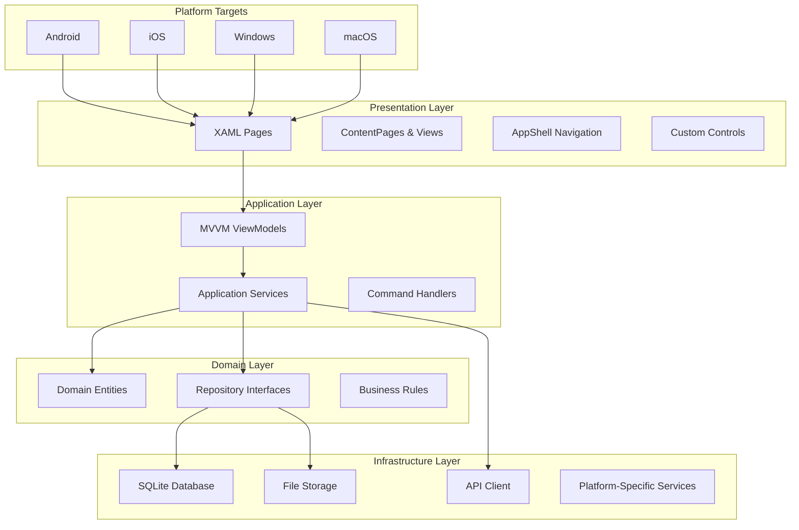

# Design Document

## Overview

The fin-track application has been successfully restructured as a pure .NET MAUI application using XAML for the user interface, providing native performance and platform-specific capabilities across all supported platforms. The architecture emphasizes offline-first functionality, cross-platform compatibility, and maintainable code separation with a modern, responsive XAML-based UI.

### Conversion Status

The application has been converted from Blazor Hybrid to pure XAML MAUI with the following completed components:

- ✅ **Project Structure**: Converted to pure MAUI SDK without Blazor dependencies
- ✅ **Navigation**: AppShell.xaml with tab-based navigation implemented
- ✅ **Core Pages**: DashboardPage, AccountsPage, ReportsPage, TransactionsPage, TransactionFormPage
- ✅ **UI Theme**: Consistent dark theme with modern card-based layouts
- ✅ **Data Binding**: Existing ViewModels integrated with XAML pages
- ✅ **Platform Support**: Android, iOS, Windows, macOS targets configured

## Architecture

### High-Level Architecture



### Project Structure

The solution follows a clean architecture pattern with the following projects:

- **FinTrack.Maui** - Main MAUI project with XAML UI and platform-specific implementations
- **FinTrack.Shared** - Shared business logic, models, and services
- **FinTrack.Core** - Domain entities and interfaces
- **FinTrack.Infrastructure** - Data access and external service implementations
- **FinTrack.Tests.Unit** - Unit tests for shared logic
- **FinTrack.Tests.Integration** - Integration tests

### XAML UI Structure

The XAML-based UI follows MAUI best practices:

```
Views/
├── DashboardPage.xaml          # Financial overview dashboard
├── TransactionsPage.xaml       # Transaction list and management
├── TransactionFormPage.xaml    # Add/edit transaction form
├── AccountsPage.xaml           # Account management
├── ReportsPage.xaml            # Financial reports and analytics
└── AppShell.xaml              # Navigation shell with tabs

ViewModels/
├── DashboardViewModel.cs
├── TransactionsViewModel.cs
├── TransactionFormViewModel.cs
├── AccountsViewModel.cs
└── ReportsViewModel.cs
```

## Components and Interfaces

### Core Components

#### 1. Data Models
- **Transaction**: Financial transaction entity with offline sync capabilities
- **Account**: User account information and balance tracking
- **Category**: Transaction categorization system
- **SyncStatus**: Tracks synchronization state of entities

#### 2. Services

##### IDataService
```csharp
public interface IDataService<T> where T : class
{
    Task<IEnumerable<T>> GetAllAsync();
    Task<T> GetByIdAsync(int id);
    Task<T> CreateAsync(T entity);
    Task<T> UpdateAsync(T entity);
    Task DeleteAsync(int id);
    Task<bool> SyncAsync();
}
```

##### IOfflineService
```csharp
public interface IOfflineService
{
    Task<bool> IsOnlineAsync();
    Task QueueForSyncAsync<T>(T entity, SyncOperation operation);
    Task ProcessSyncQueueAsync();
    event EventHandler<ConnectivityChangedEventArgs> ConnectivityChanged;
}
```

##### IPlatformService
```csharp
public interface IPlatformService
{
    Task<string> GetDeviceIdAsync();
    Task<bool> RequestPermissionAsync(Permission permission);
    Task ShowNotificationAsync(string title, string message);
    Task<string> PickFileAsync();
}
```

#### 3. Repository Pattern

##### IRepository<T>
```csharp
public interface IRepository<T> where T : BaseEntity
{
    Task<IEnumerable<T>> GetAllAsync();
    Task<T> GetByIdAsync(int id);
    Task<T> AddAsync(T entity);
    Task<T> UpdateAsync(T entity);
    Task DeleteAsync(int id);
    Task<int> SaveChangesAsync();
}
```

### XAML UI Architecture

The application uses pure XAML for the user interface with the following key components:

#### Navigation Structure
- **AppShell.xaml**: Tab-based navigation shell with 4 main sections
- **Shell Routing**: Declarative navigation with route-based page transitions
- **Modal Navigation**: Support for modal pages (e.g., transaction forms)

#### Page Structure
- **ContentPage**: Base page type for all main pages
- **MVVM Pattern**: Pages bind to ViewModels using data binding
- **Responsive Design**: Layouts adapt to different screen sizes and orientations

#### UI Components
- **Native Controls**: Uses MAUI's native control abstractions
- **Custom Styling**: Consistent dark theme across all platforms
- **Touch Optimization**: 44px minimum touch targets for mobile usability
- **Visual States**: Proper feedback for user interactions

#### Data Binding
- **Two-Way Binding**: Form inputs with automatic validation
- **Command Binding**: Button actions bound to ViewModel commands
- **Collection Binding**: Lists and grids bound to observable collections
- **Converter Support**: Value converters for data presentation

### Platform-Specific Implementations

Each platform will have specific implementations for:
- File system access
- Database location
- Notification services
- Device-specific features (camera, GPS, biometrics)
- Platform-specific UI customizations through handlers

## Data Models

### Core Entities

#### BaseEntity
```csharp
public abstract class BaseEntity
{
    public int Id { get; set; }
    public DateTime CreatedAt { get; set; }
    public DateTime UpdatedAt { get; set; }
    public bool IsDeleted { get; set; }
    public SyncStatus SyncStatus { get; set; }
    public string SyncId { get; set; }
}
```

#### Transaction
```csharp
public class Transaction : BaseEntity
{
    public decimal Amount { get; set; }
    public string Description { get; set; }
    public DateTime Date { get; set; }
    public int CategoryId { get; set; }
    public int AccountId { get; set; }
    public TransactionType Type { get; set; }
    
    // Navigation properties
    public Category Category { get; set; }
    public Account Account { get; set; }
}
```

#### Account
```csharp
public class Account : BaseEntity
{
    public string Name { get; set; }
    public decimal Balance { get; set; }
    public AccountType Type { get; set; }
    public string Currency { get; set; }
    
    // Navigation properties
    public ICollection<Transaction> Transactions { get; set; }
}
```

### Data Persistence

#### Local Database (SQLite)
- Primary storage for offline functionality
- Entity Framework Core for data access
- Automatic migrations for schema updates
- Encryption for sensitive data

#### Synchronization Model
- Conflict resolution using "last write wins" with timestamp comparison
- Tombstone records for deleted items
- Incremental sync based on last sync timestamp
- Retry mechanism for failed sync operations

## Error Handling

### Exception Hierarchy

```csharp
public class FinTrackException : Exception
{
    public string ErrorCode { get; }
    public FinTrackException(string errorCode, string message) : base(message)
    {
        ErrorCode = errorCode;
    }
}

public class DataSyncException : FinTrackException
{
    public DataSyncException(string message) : base("SYNC_ERROR", message) { }
}

public class OfflineException : FinTrackException
{
    public OfflineException(string message) : base("OFFLINE_ERROR", message) { }
}
```

### Error Handling Strategy

1. **Global Exception Handler**: Catch unhandled exceptions and log them
2. **User-Friendly Messages**: Convert technical errors to user-readable messages
3. **Retry Logic**: Automatic retry for transient failures (network, database locks)
4. **Offline Graceful Degradation**: Disable online-only features when offline
5. **Error Logging**: Comprehensive logging for debugging and monitoring

### Offline Error Handling

- Queue failed operations for retry when online
- Show appropriate offline indicators in UI
- Cache error states and retry automatically
- Provide manual sync trigger for users

## Testing Strategy

### Unit Testing
- **Framework**: xUnit with Moq for mocking
- **Coverage**: All business logic, services, and repositories
- **Test Categories**: 
  - Domain logic tests
  - Service layer tests
  - Repository tests with in-memory database
  - Offline synchronization logic tests

### Integration Testing
- **Database Integration**: Test with actual SQLite database
- **API Integration**: Test synchronization with mock API
- **Platform Integration**: Test platform-specific services

### UI Testing
- **Framework**: Platform-specific UI testing tools (Appium for mobile, WinAppDriver for Windows)
- **XAML Testing**: Direct testing of XAML elements and data binding
- **Scope**: Critical user journeys, navigation flows, and offline scenarios
- **Automated Testing**: CI/CD pipeline integration with device emulators

### Testing Structure
```
tests/
├── FinTrack.Tests.Unit/
│   ├── Services/
│   ├── Repositories/
│   ├── Domain/
│   └── Helpers/
├── FinTrack.Tests.Integration/
│   ├── Database/
│   ├── Sync/
│   └── Platform/
└── FinTrack.Tests.UI/
    ├── Web/
    ├── Mobile/
    └── Desktop/
```

### Offline Testing Scenarios
- Application startup without internet
- Data modification while offline
- Sync conflict resolution
- Network interruption during sync
- Large dataset synchronization performance