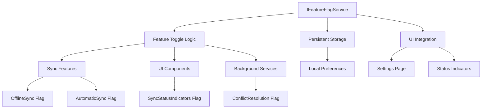
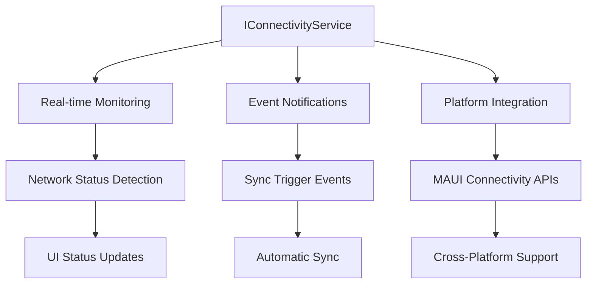
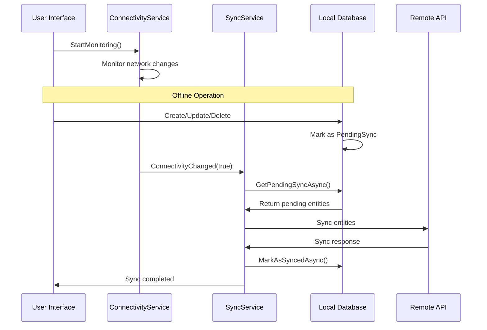
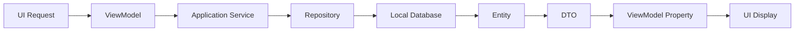
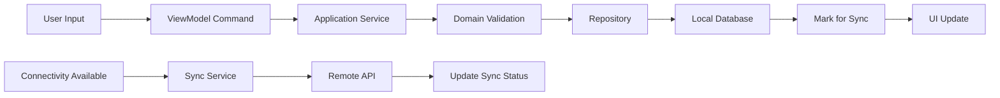
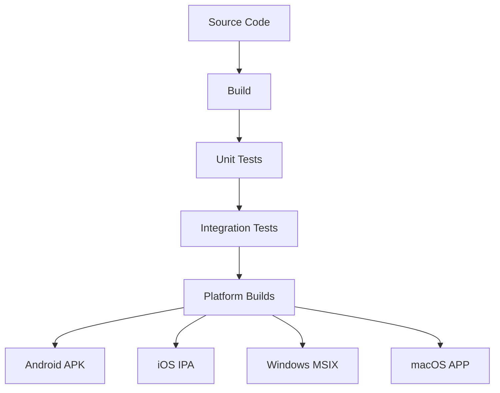

# Architecture Overview

## System Architecture

FinTrack follows a clean architecture pattern with offline-first design principles. The application is structured in layers with clear separation of concerns and dependency inversion.

## Layer Responsibilities

### 1. Presentation Layer (FinTrack.Maui)
- **XAML Pages**: User interface definitions using XAML markup
- **ViewModels**: MVVM pattern implementation with data binding
- **Platform Services**: Platform-specific implementations
- **Navigation**: AppShell-based navigation system

### 2. Application Layer (FinTrack.Shared)
- **Application Services**: Business logic coordination
- **Feature Flag Service**: Runtime feature toggling and management
- **Command Handlers**: Command pattern implementations
- **Query Handlers**: Query processing logic
- **DTOs**: Data transfer objects for service communication

### 3. Domain Layer (FinTrack.Core)
- **Entities**: Core business entities with domain logic
- **Interfaces**: Contracts for repositories and services
- **Enums**: Domain-specific enumerations (SyncStatus, SyncOperation, TransactionType)
- **Value Objects**: Immutable domain value types (Money, DateRange, SyncMetadata)

### 4. Infrastructure Layer (FinTrack.Infrastructure)
- **Repositories**: Data access implementations
- **Database Context**: Entity Framework Core configuration
- **External Services**: API clients and external integrations
- **Platform Abstractions**: Cross-platform service implementations

## Offline-First Architecture

### Feature Flag Management

The `IFeatureFlagService` provides runtime control over application features:



### Connectivity Management

The `IConnectivityService` is central to the offline-first architecture:



### Data Synchronization Flow



### Sync Status Management

Each entity tracks its synchronization state using the `SyncStatus` enum:

- **Synced**: Entity is up-to-date with remote server
- **PendingCreate**: New entity waiting to be created on server
- **PendingUpdate**: Modified entity waiting to be updated on server
- **PendingDelete**: Deleted entity waiting to be removed from server
- **SyncFailed**: Sync operation failed, needs retry
- **Conflict**: Sync conflict detected, needs resolution

## Data Flow Architecture

### Read Operations


### Write Operations


## Cross-Platform Considerations

### Platform-Specific Services

Each platform provides specific implementations:

```csharp
// Platform-specific registration
#if ANDROID
builder.Services.AddSingleton<IPlatformService, AndroidPlatformService>();
#elif IOS
builder.Services.AddSingleton<IPlatformService, iOSPlatformService>();
#elif WINDOWS
builder.Services.AddSingleton<IPlatformService, WindowsPlatformService>();
#endif
```

### XAML UI Adaptation

The XAML UI adapts to different platforms:
- **Responsive Layouts**: Grid and StackLayout adapt to screen sizes
- **Platform Handlers**: Custom renderers for platform-specific behavior
- **Resource Dictionaries**: Platform-specific styling and resources

## Performance Considerations

### Database Optimization
- **Indexed Queries**: Strategic indexing on frequently queried columns
- **Lazy Loading**: Navigation properties loaded on demand
- **Connection Pooling**: Efficient database connection management
- **Batch Operations**: Bulk operations for sync scenarios

### Memory Management
- **Weak References**: Event subscriptions use weak references
- **Disposal Patterns**: Proper IDisposable implementation
- **Collection Virtualization**: Large lists use virtualization
- **Image Caching**: Efficient image loading and caching

### Network Optimization
- **Incremental Sync**: Only sync changed data
- **Compression**: Request/response compression
- **Retry Logic**: Exponential backoff for failed requests
- **Background Sync**: Non-blocking synchronization

## Security Architecture

### Data Protection
- **Local Encryption**: SQLite database encryption
- **Secure Storage**: Platform keychain/keystore integration
- **Token Management**: Secure authentication token storage
- **Data Validation**: Input validation and sanitization

### Network Security
- **HTTPS Only**: All API communication over HTTPS
- **Certificate Pinning**: API certificate validation
- **Request Signing**: API request authentication
- **Rate Limiting**: Client-side request throttling

## Testing Strategy

### Unit Testing (FinTrack.Tests.Unit)
- **Domain Logic**: Pure business logic testing without UI dependencies
- **Service Layer**: Mocked dependency testing for application services
- **Repository Layer**: In-memory database testing for data access
- **Sync Logic**: Offline synchronization and conflict resolution testing
- **Project References**: Core, Shared, and Infrastructure only (NOT Maui)
- **Isolation Principle**: Tests run independently without UI framework overhead

### Integration Testing (FinTrack.Tests.Integration)
- **Database Integration**: Real SQLite database testing with migrations
- **API Integration**: Mock server testing for sync operations
- **Platform Integration**: Platform service testing across all targets
- **Sync Testing**: End-to-end sync scenario testing with conflict resolution
- **UI Integration**: ViewModel and page integration testing

### UI Testing
- **XAML Testing**: Page navigation and data binding testing
- **Platform Testing**: Cross-platform UI consistency verification
- **Accessibility Testing**: Screen reader and keyboard navigation
- **Performance Testing**: UI responsiveness and memory usage
- **ViewModel Testing**: Command execution and property change notification

### Sync Testing Infrastructure

The sync testing infrastructure provides specialized utilities for testing synchronization scenarios:

```csharp
// SyncTestHelpers provides type-safe test object creation
public static class SyncTestHelpers
{
    // Creates sync state change events using actual Core interfaces
    public static SyncStateChangedEventArgs CreateSyncStateChangedEventArgs(
        SyncState previousState, 
        SyncState currentState,
        string? errorMessage = null);
    
    // Creates sync conflicts for resolution testing
    public static SyncConflict CreateSyncConflict(
        string id, string entityType, string entityId,
        string localData, string remoteData);
}
```

**Key Benefits:**
- **Type Safety**: Uses actual `FinTrack.Core.Interfaces` types, not test duplicates
- **Interface Consistency**: Test objects automatically match production contracts
- **Maintainability**: Core interface changes propagate to tests via compilation
- **Convenience**: Simplifies complex sync scenario setup in tests

### Test Architecture Benefits
- **Fast Unit Tests**: No UI dependencies means faster test execution
- **Clean Separation**: Unit tests focus on business logic, not presentation
- **Maintainability**: Changes to UI don't break unit tests
- **Parallel Execution**: Unit tests can run in parallel without UI thread conflicts
- **CI/CD Friendly**: Unit tests run efficiently in build pipelines
- **Interface Compliance**: Test helpers ensure compatibility with production interfaces

## Deployment Architecture

### Build Pipeline


### Platform Distribution
- **Android**: Google Play Store and APK sideloading
- **iOS**: Apple App Store and TestFlight
- **Windows**: Microsoft Store and MSIX installer
- **macOS**: Mac App Store and DMG installer

## Monitoring and Diagnostics

### Application Insights
- **Crash Reporting**: Automatic crash detection and reporting
- **Performance Monitoring**: App performance metrics
- **Usage Analytics**: Feature usage tracking
- **Custom Events**: Business-specific event tracking

### Logging Strategy
- **Structured Logging**: JSON-formatted log entries
- **Log Levels**: Appropriate log level usage
- **Platform Logging**: Platform-specific log destinations
- **Remote Logging**: Optional cloud log aggregation