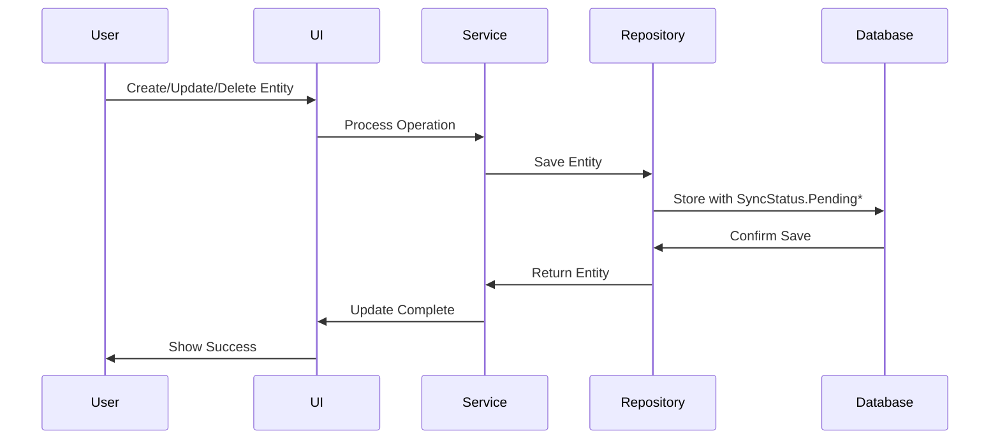
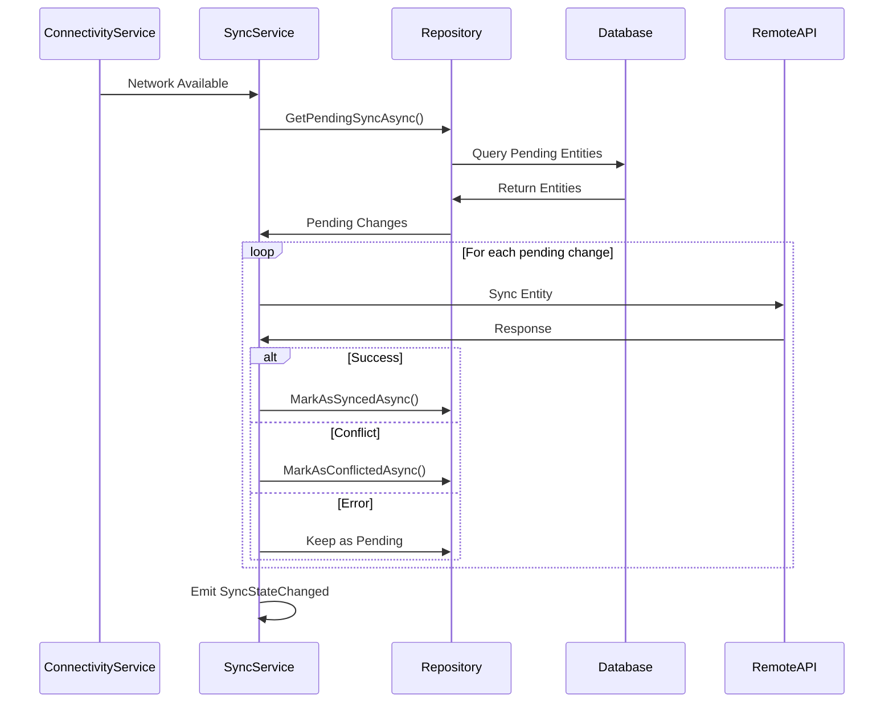
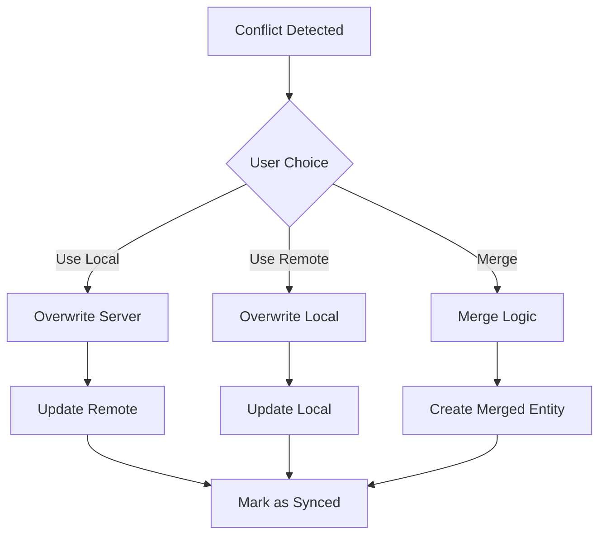

# Synchronization Architecture

## Overview

FinTrack implements a robust offline-first synchronization system that allows users to work seamlessly without internet connectivity while ensuring data consistency across devices when online.

## Core Components

### ISyncService Interface

The `ISyncService` is the central coordination point for all synchronization operations:

```csharp
public interface ISyncService
{
    SyncState CurrentState { get; }
    int PendingChangesCount { get; }
    DateTime? LastSyncTime { get; }
    
    event EventHandler<SyncStateChangedEventArgs> SyncStateChanged;
    event EventHandler<int> PendingChangesCountChanged;
    
    Task StartAsync(CancellationToken cancellationToken = default);
    Task StopAsync(CancellationToken cancellationToken = default);
    Task SyncAsync(CancellationToken cancellationToken = default);
    
    Task<IEnumerable<PendingChange>> GetPendingChangesAsync(CancellationToken cancellationToken = default);
    Task<IEnumerable<SyncConflict>> GetConflictsAsync(CancellationToken cancellationToken = default);
    Task ResolveConflictAsync(string conflictId, ConflictResolution resolution, CancellationToken cancellationToken = default);
}
```

### Sync States

The synchronization system operates in four distinct states:

```csharp
public enum SyncState
{
    Idle,       // Ready for sync operations
    Syncing,    // Currently synchronizing data
    Error,      // Sync operation failed
    Offline     // No network connectivity
}
```

### Sync Operations

Each entity change is tracked with a specific operation type:

```csharp
public enum SyncOperation
{
    Create,     // Entity needs to be created on server
    Update,     // Entity needs to be updated on server
    Delete,     // Entity needs to be deleted on server
    None        // Entity is already synced
}
```

### Entity Sync Status

Every entity tracks its synchronization state:

```csharp
public enum SyncStatus
{
    Synced,         // Entity is synchronized with server
    PendingCreate,  // New entity waiting to be created
    PendingUpdate,  // Modified entity waiting to be updated
    PendingDelete,  // Deleted entity waiting to be removed
    SyncFailed,     // Sync operation failed, needs retry
    Conflict        // Sync conflict detected, needs resolution
}
```

## Synchronization Flow

### Offline Operations



### Online Synchronization



## Conflict Resolution

### Conflict Detection

Conflicts occur when the same entity is modified on multiple devices:

```csharp
public class SyncConflict
{
    public string Id { get; set; }
    public string EntityType { get; set; }
    public string EntityId { get; set; }
    public string LocalData { get; set; }      // Local version
    public string RemoteData { get; set; }     // Server version
    public DateTime ConflictDetectedAt { get; set; }
    public string? Description { get; set; }
}
```

### Resolution Strategies

```csharp
public enum ConflictResolution
{
    UseLocal,   // Keep local changes, overwrite server
    UseRemote,  // Discard local changes, use server version
    Merge       // Attempt to merge both versions (future)
}
```

### Resolution Process



## Feature Flag Integration

The sync system integrates with the feature flag service for runtime control:

### Available Flags

```csharp
public static class FeatureFlags
{
    public const string OfflineSync = "OfflineSync";
    public const string SyncStatusIndicators = "SyncStatusIndicators";
    public const string AutomaticSync = "AutomaticSync";
    public const string ConflictResolution = "ConflictResolution";
}
```

### Flag Usage

```csharp
// Check if sync is enabled before operations
if (_featureFlagService.IsFeatureEnabled(FeatureFlags.OfflineSync))
{
    await _syncService.SyncAsync();
}

// Show/hide UI elements based on flags
syncIndicator.IsVisible = _featureFlagService.IsFeatureEnabled(FeatureFlags.SyncStatusIndicators);
```

## UI Integration

### Sync Status Display

The UI provides real-time sync status through the `SyncStatusViewModel`:

```csharp
public class SyncStatusViewModel : INotifyPropertyChanged
{
    public bool IsOnline { get; }
    public SyncState SyncState { get; }
    public int PendingChangesCount { get; }
    public string StatusText { get; }
    public Color StatusColor { get; }
    public bool HasPendingChanges { get; }
}
```

### Visual Indicators

- **Green**: All data synced
- **Orange**: Pending changes or offline
- **Blue**: Currently syncing
- **Red**: Sync error occurred

### User Interactions

- **Tap Sync Status**: Show sync options menu
- **Manual Sync**: Trigger immediate synchronization
- **View Conflicts**: Display and resolve conflicts
- **Pending Changes**: Show queued operations

## Testing Infrastructure

### SyncTestHelpers

The `SyncTestHelpers` class provides utilities for testing sync scenarios:

```csharp
public static class SyncTestHelpers
{
    // Create test sync state change events
    public static SyncStateChangedEventArgs CreateSyncStateChangedEventArgs(
        SyncState previousState, 
        SyncState currentState,
        string? errorMessage = null)
    {
        return new SyncStateChangedEventArgs
        {
            PreviousState = previousState,
            CurrentState = currentState,
            ErrorMessage = errorMessage,
            Timestamp = DateTime.UtcNow
        };
    }

    // Create test sync conflicts
    public static SyncConflict CreateSyncConflict(
        string id,
        string entityType,
        string entityId,
        string localData,
        string remoteData)
    {
        return new SyncConflict
        {
            Id = id,
            EntityType = entityType,
            EntityId = entityId,
            LocalData = localData,
            RemoteData = remoteData,
            ConflictDetectedAt = DateTime.UtcNow
        };
    }
}
```

### Test Scenarios

Common sync testing scenarios:

```csharp
[Test]
public async Task SyncService_WhenOffline_ShouldQueueChanges()
{
    // Arrange
    var syncService = CreateMockSyncService();
    var eventArgs = SyncTestHelpers.CreateSyncStateChangedEventArgs(
        SyncState.Idle, SyncState.Offline);
    
    // Act
    await syncService.ProcessOfflineChange(entity);
    
    // Assert
    Assert.AreEqual(1, syncService.PendingChangesCount);
}

[Test]
public async Task ConflictResolution_UseLocal_ShouldOverwriteRemote()
{
    // Arrange
    var conflict = SyncTestHelpers.CreateSyncConflict(
        "conflict-1", "Transaction", "txn-123",
        "local-data", "remote-data");
    
    // Act
    await syncService.ResolveConflictAsync(conflict.Id, ConflictResolution.UseLocal);
    
    // Assert
    // Verify local data was sent to server
}
```

## Performance Considerations

### Batch Operations

- **Bulk Sync**: Process multiple entities in single API calls
- **Pagination**: Handle large datasets with paged synchronization
- **Throttling**: Limit concurrent sync operations to prevent overwhelming

### Memory Management

- **Streaming**: Process large sync operations without loading all data into memory
- **Cleanup**: Automatically clean up old sync metadata
- **Caching**: Cache frequently accessed sync status information

### Network Optimization

- **Delta Sync**: Only sync changed fields, not entire entities
- **Compression**: Compress sync payloads for faster transfer
- **Retry Logic**: Exponential backoff for failed sync operations
- **Background Sync**: Perform sync operations without blocking UI

## Error Handling

### Sync Errors

Common sync error scenarios and handling:

1. **Network Timeout**: Retry with exponential backoff
2. **Server Error**: Queue for later retry
3. **Authentication Error**: Prompt user to re-authenticate
4. **Conflict**: Present resolution options to user
5. **Data Validation**: Show validation errors and allow correction

### Error Recovery

```csharp
public async Task HandleSyncError(SyncError error)
{
    switch (error.Type)
    {
        case SyncErrorType.NetworkTimeout:
            await RetryWithBackoff(error.Operation);
            break;
        case SyncErrorType.Conflict:
            await PresentConflictResolution(error.Conflict);
            break;
        case SyncErrorType.ValidationError:
            await ShowValidationErrors(error.ValidationErrors);
            break;
    }
}
```

## Security Considerations

### Data Protection

- **Encryption**: Encrypt sensitive data in sync payloads
- **Authentication**: Verify user identity for all sync operations
- **Authorization**: Ensure users can only sync their own data
- **Audit Trail**: Log all sync operations for security monitoring

### Conflict Security

- **Data Validation**: Validate all incoming data during conflict resolution
- **Permission Checks**: Verify user permissions before applying changes
- **Sanitization**: Sanitize user input in conflict data
- **Rollback**: Ability to rollback sync operations if security issues detected

## Monitoring and Diagnostics

### Sync Metrics

Key metrics to monitor:

- **Sync Success Rate**: Percentage of successful sync operations
- **Conflict Rate**: Frequency of sync conflicts
- **Sync Duration**: Time taken for sync operations
- **Pending Changes**: Number of queued operations
- **Error Rate**: Frequency and types of sync errors

### Logging

Comprehensive logging for sync operations:

```csharp
_logger.LogInformation("Sync started: {PendingCount} changes", pendingCount);
_logger.LogWarning("Sync conflict detected: {EntityType} {EntityId}", entityType, entityId);
_logger.LogError("Sync failed: {Error}", error.Message);
_logger.LogInformation("Sync completed: {SyncedCount} synced, {ConflictCount} conflicts", syncedCount, conflictCount);
```

## Future Enhancements

### Planned Features

1. **Smart Merge**: Automatic conflict resolution for non-conflicting fields
2. **Selective Sync**: Allow users to choose which data types to sync
3. **Sync Scheduling**: Configure automatic sync intervals
4. **Bandwidth Optimization**: Adaptive sync based on connection quality
5. **Multi-Server Sync**: Support for multiple sync endpoints
6. **Real-time Sync**: WebSocket-based real-time synchronization