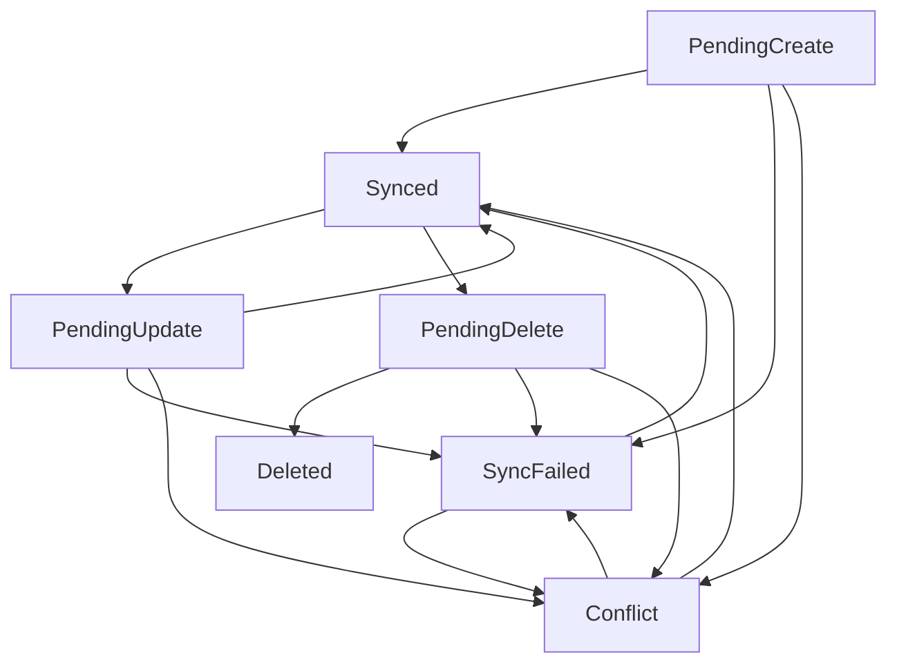

# Value Objects

FinTrack uses value objects to encapsulate domain concepts and ensure type safety throughout the application. Value objects are immutable and provide business logic related to their specific domain concepts.

## Overview

Value objects in FinTrack are implemented as C# records, providing:
- **Immutability**: Values cannot be changed after creation
- **Equality**: Structural equality based on values, not reference
- **Type Safety**: Prevents primitive obsession and invalid states
- **Business Logic**: Encapsulates domain-specific operations

## Money Value Object

The `Money` value object represents monetary amounts with currency validation and arithmetic operations.

### Features

- **Currency Validation**: Enforces 3-letter ISO currency codes (USD, EUR, GBP, etc.)
- **Case Normalization**: Automatically converts currency codes to uppercase
- **Arithmetic Operations**: Safe mathematical operations with currency consistency
- **Utility Methods**: Common financial calculations and checks

### Usage Examples

```csharp
// Creating Money instances
var price = new Money(100.50m, "USD");
var discount = new Money(10.00m, "usd"); // Normalized to "USD"

// Arithmetic operations (same currency required)
var total = price + discount;           // 110.50 USD
var remaining = price - discount;       // 90.50 USD
var doubled = price * 2;               // 201.00 USD
var half = price / 2;                  // 50.25 USD

// Utility methods
var isExpensive = price.IsPositive;     // true
var absolute = price.Abs();            // Always positive
var negated = price.Negate();          // -100.50 USD

// Factory methods
var zero = Money.Zero("USD");          // 0.00 USD

// String representation
Console.WriteLine(price);              // "100.50 USD"
```

### Validation Rules

- Currency must be exactly 3 characters
- Currency cannot be null or whitespace
- Different currencies cannot be used in arithmetic operations
- Division by zero throws `DivideByZeroException`

### Error Handling

```csharp
// These will throw ArgumentException
new Money(100m, "US");        // Too short
new Money(100m, "USDD");      // Too long
new Money(100m, "");          // Empty
new Money(100m, null);        // Null

// This will throw InvalidOperationException
var usd = new Money(100m, "USD");
var eur = new Money(100m, "EUR");
var invalid = usd + eur;      // Different currencies
```

## DateRange Value Object

The `DateRange` value object represents date ranges with validation and utility methods for financial reporting periods.

### Features

- **Date Validation**: Ensures start date is not after end date
- **Date Normalization**: Strips time components for date-only operations
- **Factory Methods**: Common date range patterns for financial periods
- **Range Operations**: Contains, overlaps, and duration calculations

### Usage Examples

```csharp
// Creating DateRange instances
var range = new DateRange(
    new DateTime(2024, 1, 1), 
    new DateTime(2024, 1, 31)
);

// Factory methods for common periods
var currentMonth = DateRange.CurrentMonth();
var currentYear = DateRange.CurrentYear();
var lastWeek = DateRange.LastDays(7);
var january2024 = DateRange.ForMonth(2024, 1);

// Range operations
var isInRange = currentMonth.Contains(DateTime.Today);
var overlaps = range.OverlapsWith(currentMonth);
var dayCount = range.DayCount;

// String representation
Console.WriteLine(range);     // "2024-01-01 to 2024-01-31"
```

### Factory Methods

| Method | Description | Example |
|--------|-------------|---------|
| `CurrentMonth()` | Current calendar month | Jan 1-31, 2024 |
| `CurrentYear()` | Current calendar year | Jan 1 - Dec 31, 2024 |
| `LastDays(n)` | Last N days including today | Last 7 days |
| `ForMonth(year, month)` | Specific month and year | March 2023 |

### Validation Rules

- Start date must be less than or equal to end date
- Dates are normalized to date-only (time stripped)
- Days parameter for `LastDays()` must be positive

## SyncMetadata Value Object

The `SyncMetadata` value object encapsulates synchronization state and metadata for offline-first functionality.

### Features

- **State Management**: Tracks synchronization status and transitions
- **Version Control**: Optimistic concurrency control with version numbers
- **Error Tracking**: Records sync failures and retry attempts
- **Device Tracking**: Identifies which device last modified the entity

### Usage Examples

```csharp
// Creating new sync metadata
var metadata = SyncMetadata.CreateNew("device-123");
var synced = SyncMetadata.CreateSynced("sync-id", 1, "device-123");

// State transitions
var modified = metadata.MarkAsModified("device-456");
var deleted = metadata.MarkAsDeleted("device-456");
var syncFailed = metadata.MarkAsSyncFailed("Network error");
var conflicted = metadata.MarkAsConflicted("Version mismatch");
var resolved = conflicted.MarkAsSynced();

// Status checks
var needsSync = metadata.NeedsSync;        // true for pending operations
var hasIssues = metadata.HasSyncIssues;    // true for failures/conflicts
var isSynced = metadata.IsSynced;          // true when fully synced
```

### State Transitions



### Properties

| Property | Type | Description |
|----------|------|-------------|
| `Status` | `SyncStatus` | Current synchronization status |
| `SyncId` | `string` | Unique identifier for sync operations |
| `LastSyncAt` | `DateTime?` | Timestamp of last successful sync |
| `Version` | `long` | Version number for optimistic concurrency |
| `LastModifiedBy` | `string?` | Device ID of last modification |
| `RetryCount` | `int` | Number of sync retry attempts |
| `LastSyncAttempt` | `DateTime?` | Timestamp of last sync attempt |
| `LastSyncError` | `string?` | Error message from failed sync |

## Integration with Entities

Value objects are integrated into domain entities to provide type safety and encapsulate business logic:

```csharp
public class Transaction : BaseEntity
{
    // Using Money value object instead of decimal + string
    public Money Amount { get; set; }
    
    // Using SyncMetadata instead of individual sync properties
    public SyncMetadata SyncMetadata { get; set; }
    
    // Other properties...
}

public class Budget : BaseEntity
{
    public Money Limit { get; set; }
    public Money Spent { get; set; }
    public DateRange Period { get; set; }
    
    // Business logic using value objects
    public Money Remaining => Limit - Spent;
    public bool IsOverBudget => Spent.Amount > Limit.Amount;
    public decimal UtilizationPercentage => 
        Limit.Amount > 0 ? (Spent.Amount / Limit.Amount) * 100 : 0;
}
```

## Testing Value Objects

Value objects are thoroughly tested to ensure correctness and reliability:

### Money Tests
- Currency validation and normalization
- Arithmetic operations and currency consistency
- Edge cases (null currency, division by zero)
- Utility methods and property checks

### DateRange Tests
- Date validation and normalization
- Factory method functionality
- Range operations and boundary conditions
- Overlap detection and duration calculations

### SyncMetadata Tests
- State transitions and version management
- Error handling and retry logic
- Device tracking and conflict resolution
- Status checks and business logic

## Best Practices

### When to Use Value Objects

✅ **Use value objects when:**
- Representing domain concepts with validation rules
- Encapsulating related data and behavior
- Ensuring type safety and preventing primitive obsession
- Implementing immutable data structures

❌ **Avoid value objects when:**
- Simple primitive values without business logic
- Mutable data that changes frequently
- Performance-critical scenarios with high allocation rates

### Design Guidelines

1. **Immutability**: Always make value objects immutable
2. **Validation**: Validate inputs in constructors
3. **Equality**: Implement structural equality (automatic with records)
4. **Business Logic**: Include relevant domain operations
5. **Factory Methods**: Provide convenient creation methods
6. **Error Handling**: Throw meaningful exceptions for invalid states

### Performance Considerations

- Value objects are allocated on each creation
- Use factory methods to reduce allocation overhead
- Consider caching for frequently used values
- Profile memory usage in performance-critical paths

## Current Goal Implementation

The Goal entity currently implements progress tracking through direct properties rather than a separate value object:

```csharp
public class Goal : BaseEntity
{
    // Progress calculation properties
    public decimal ProgressPercentage => TargetAmount > 0 ? Math.Min((CurrentAmount / TargetAmount) * 100, 100) : 0;
    public decimal RemainingAmount => Math.Max(TargetAmount - CurrentAmount, 0);
    public int DaysRemaining => Math.Max((TargetDate - DateTime.Now).Days, 0);
    public bool IsOverdue => DateTime.Now > TargetDate && !IsCompleted;
    
    // Smart monthly savings calculation
    public decimal RequiredMonthlySavings
    {
        get
        {
            if (IsCompleted || DaysRemaining <= 0) return 0;
            var monthsRemaining = Math.Max(DaysRemaining / 30.0m, 1);
            return RemainingAmount / monthsRemaining;
        }
    }
}
```

This approach provides:
- **Real-time Calculations**: Properties are calculated on-demand
- **Edge Case Handling**: Proper handling of completed and overdue goals
- **Business Logic Integration**: Direct integration with entity state
- **Performance**: No additional object allocation for simple calculations

## Future Enhancements

Potential future value objects for FinTrack:

- **AccountNumber**: Bank account number validation and formatting
- **CategoryPath**: Hierarchical category path representation
- **ExchangeRate**: Currency conversion rates with timestamps
- **RecurrencePattern**: Recurring transaction patterns and schedules
- **GoalProgress**: Could be considered if more complex progress tracking is needed (currently handled by Goal entity properties)